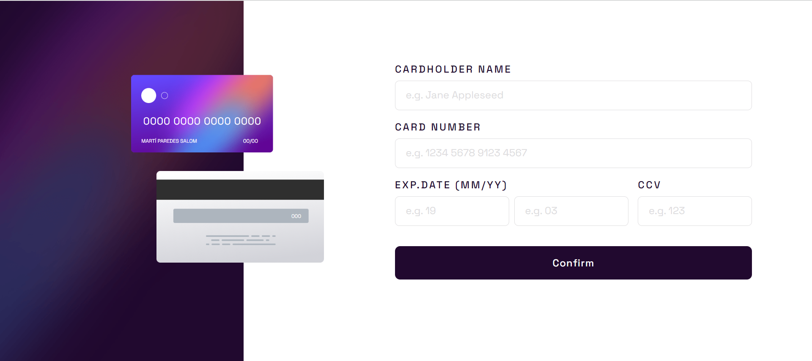
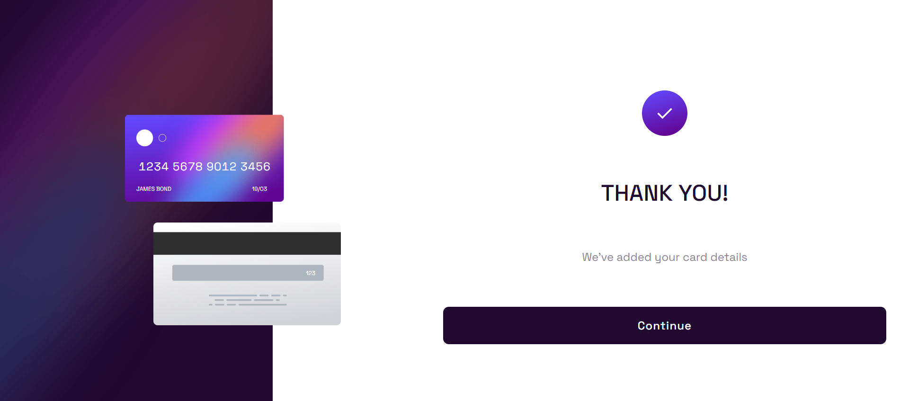
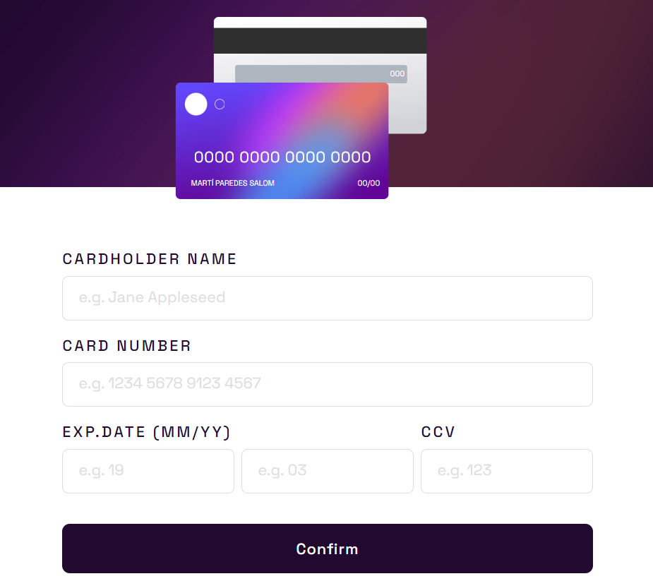
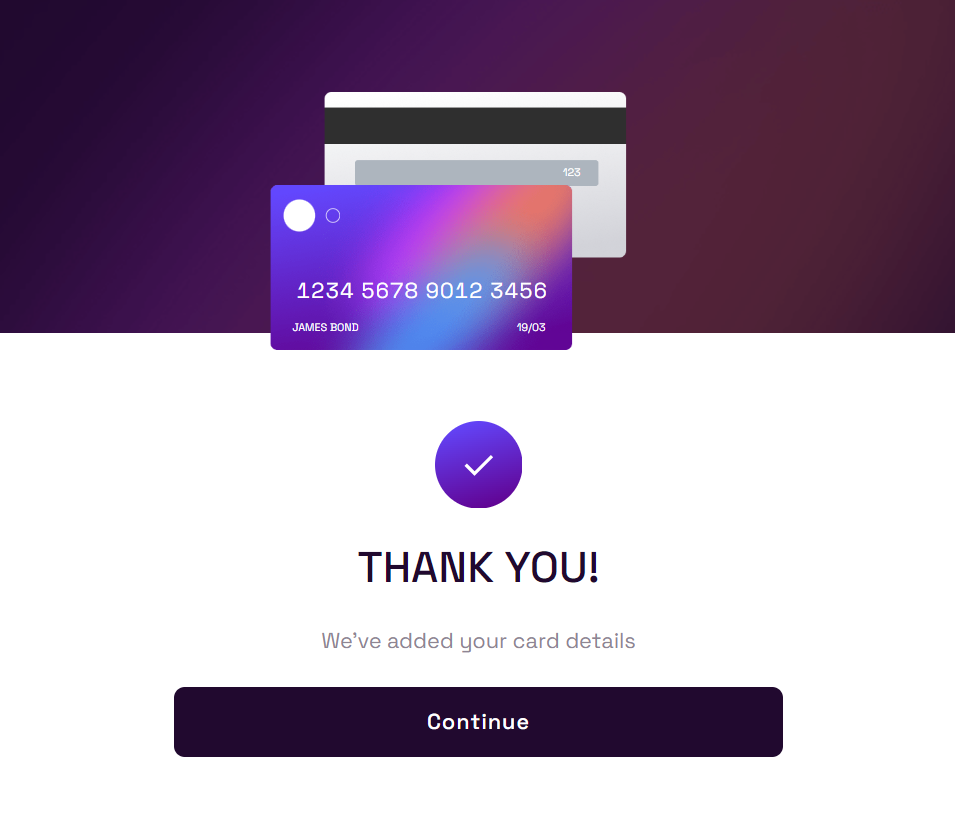

# Frontend Mentor - Interactive card details form solution

This is a solution to the [Interactive card details form challenge on Frontend Mentor](https://www.frontendmentor.io/challenges/interactive-card-details-form-XpS8cKZDWw). Frontend Mentor challenges help you improve your coding skills by building realistic projects. 

## Table of contents

- [Frontend Mentor - Interactive card details form solution](#frontend-mentor---interactive-card-details-form-solution)
    - [Table of contents](#table-of-contents)
    - [Overview](#overview)
        - [The challenge](#the-challenge)
        - [Screenshot](#screenshot)
                - [Desktop View](#desktop-view)
                - [Mobile View](#mobile-view)
        - [Links](#links)
    - [My process](#my-process)
    - [Author](#author)

## Overview

### The challenge

Users should be able to:

- Fill in the form and see the card details update in real-time
- Receive error messages when the form is submitted if:
  - Any input field is empty
  - The card number, expiry date, or CVC fields are in the wrong format
- View the optimal layout depending on their device's screen size
- See hover, active, and focus states for interactive elements on the page

### Screenshot

##### Desktop View

##### Mobile View

### Links

- Solution URL: [https://github.com/multiparedes/interactiveCardDetails](https://github.com/multiparedes/interactiveCardDetails)
- Live Site URL: [https://interactive-card-details-six.vercel.app/](https://interactive-card-details-six.vercel.app/)

## My process

I started this project with a very basic level of JavaScript, I programed with Java so the change wasn't very heavy. I encounter some problems with the DOM manipulation but I think I managed to fix them and give the page a good and interactive look.

I also run into a problem with the inputs and low res devices which I didn't manage to fix, if someone could help me I would be soo happy <3.

I used a mobile first aproach and then expanded the design to a desktop view.

## Author

- Github - [Multiparedes](https://github.com/multiparedes)
- Frontend Mentor - [@multiparedes](https://www.frontendmentor.io/profile/multiparedes)